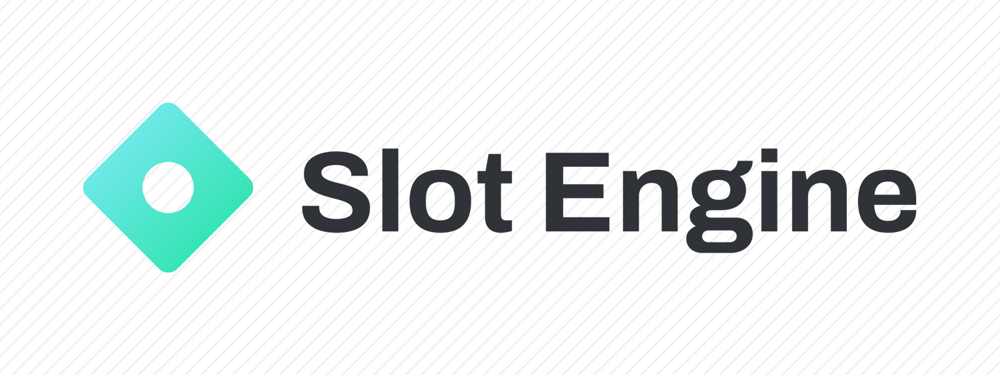

> [!NOTE]
> Slot Engine is a community project and is not affiliated with Stake.

# Slot Engine

TypeScript libraries for building slot games.

## Available Packages

### `@slot-engine/core`

Library for configuring and simulating slot games. Produces output compatible with Stake Engine / Stake RGS.

[📖 Documentation](https://slot-engine.dev/docs/core)  

### `@slot-engine/panel`

Web GUI for interacting with Slot Engine. Run simulations, view statistics, explore game files.

[📖 Documentation](https://slot-engine.dev/docs/panel)

### (WIP) `@slot-engine/lgs`

Local gaming server. Test your game locally without uploading to Stake Engine and save time during development.

[📖 Documentation](https://slot-engine.dev/docs/lgs)

## Contributing

See [the contributing guide](CONTRIBUTING.md) for more information.
